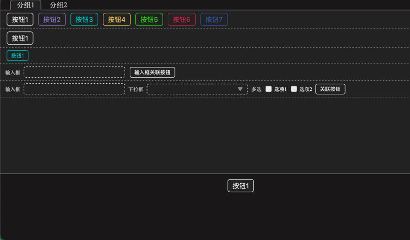

## 项目介绍
```
iTerm2 自带的 Status Bar 可以添加按钮，但是显示范围太小，可添加的按钮数较少，无法进行分组
本项目使用 iTerm2 的 Python API 在 Status Bar 添加一个按钮，点击按钮后显示一个html，进行按钮分组显示和编辑
```
## 展示图


## 安装方法
```
1. 在iTerm2创建脚本环境
1.1. 点击菜单栏Scripts->Manage->New Python Script
1.2. 在弹框中选择Full Environment->Long-Running Daemon
1.3. 选择Scripts目录中的AutoLaunch(如果没有自己创建)
1.4. 在名称框中输入iterm2_shortcut_html2
1.5. 在PyPI Dependencies中输入setup.cfg文件中的install_requires的内容
1.6. 在Python Version中选择3.7.9
1.7. 点击保存

2. 执行命名和使用
2.1 执行 mv ~/Library/Application\ Support/iTerm2/Scripts/AutoLaunch/iterm2_shortcut_html2/iterm2env ~/Library/Application\ Support/iTerm2/Scripts/AutoLaunch/
2.2 执行 rm -rf ~/Library/Application\ Support/iTerm2/Scripts/AutoLaunch/iterm2_shortcut_html2
2.3 执行 mv [[项目本地路径]] ~/Library/Application\ Support/iTerm2/Scripts/AutoLaunch/iterm2_shortcut_html2
2.4 执行 mv ~/Library/Application\ Support/iTerm2/Scripts/AutoLaunch/iterm2env ~/Library/Application\ Support/iTerm2/Scripts/AutoLaunch/iterm2_shortcut_html2/iterm2env
2.5 重新启动 iTerm2
2.6 在 Status Bar 添加 Shortcut html2 到 Status Bar
```